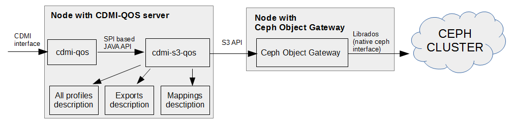

# Interface to QoS metrics

This chapter presents the relations and interfaces between main components of cdmi-qos server, cdmi-s3-qos module and Ceph Object Gateway.

## Components overview

The overall picture of environment which utilizes cdmi-s3-qos module is depicted in the figure below. Next to it, you will find short description of depicted components and interfaces.

The cdmi-qos server communicates with cdmi-s3-qos module via Java specified API. The module itself communicates with Ceph Object Gateweay via S3 API. Additionally the module uses local configuration files which describe: all QoS profiles which are provided by underlying CEPH, mappings between S3 buckets and QoS profiles and export attributes which provide information required to combine find S3 URLs to data objects.

The cdmi-qos server is developed by INDIGO project. It is based on reference implementation of CDMI server provided by SNIA organization. Comparing to the reference implementation, the cdmi-qos server has been extended with the ability to dynamically find and integrate with “QoS Storage Back-end Modules” modules. From end-user point of view, all cdmi-qos server functionality is available via CDMI interface, which is REST inspired protocol defined over HTTP/HTTPS.

In the above picture, things like particular QoS profiles attributes, mappings between S3 buckets and underlying QoS profiles as well as hints required to find S3 URLs to data objects are provided respectively by "All profiles description", "Export description" and "Mappings description" elements. The boxes which represents these elements are placed on the same node as cdmi-s3-qos module what means that these elements are locally available (actually they are configuration files with a bit of additional computing logic around them).

Some information cannot be stored in form of local configuration. Therefore support for S3 objects browsing and access to attributes like object creation date are implemented directly with help of S3 API. In these cases the cdmi-s3-qos module uses S3 API to talk to Ceph Object Gateway.
